# Supply Chain Security Pipeline

A complete CI/CD pipeline that implements software supply chain security controls — SBOM generation, artifact signing, SLSA provenance, and admission control — enforcing that only signed, verified, and attested container images reach a Kubernetes cluster.

## Overview

Regulatory pressure around software supply chain security is accelerating. The EU Cyber Resilience Act now requires machine-readable SBOMs for any software sold in the EU. CISA's 2025 updated minimum elements expand required metadata for provenance and authenticity. NIST SP 800-218 recommends SBOM generation and artifact signing as standard practice. Organisations that can't prove what's inside their software, who built it, and whether it's been tampered with are increasingly exposed — both to attackers and to regulators.

This project implements the full verification chain from source to deployment. A GitHub Actions build pipeline generates SBOMs in both SPDX and CycloneDX formats using Syft, scans them for vulnerabilities with Grype, signs the container image using Sigstore cosign (keyless, via GitHub Actions OIDC identity), and attaches SLSA provenance attestations. A separate verification pipeline then re-validates every attestation before deploying to EKS. On the cluster side, five Kyverno admission control policies enforce that only images which pass the complete chain — signature verification, provenance check, SBOM attestation, registry restriction, and container hardening — are allowed to run.

This project complements my [End-to-End DevSecOps Pipeline](https://github.com/nfroze/End-to-End-DevSecOps-Transformation), which covers code-level security scanning (SAST, DAST, SCA, secrets, IaC). This project covers the layer above that: who built the artifact, what's inside it, and can you cryptographically prove it hasn't been tampered with. Together they represent complete pipeline security coverage from source to runtime.

## Architecture

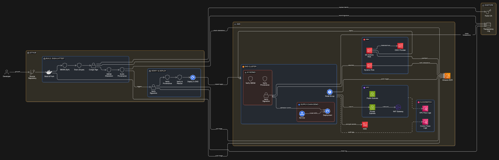

The pipeline runs as two sequential GitHub Actions workflows. The build workflow compiles the application, pushes to Amazon ECR, generates dual-format SBOMs via Syft, gates on Grype vulnerability scan results, signs the image with cosign keyless signing (recording the signature in Sigstore's Rekor transparency log), and attaches SBOM and SLSA provenance attestations to the image in ECR as OCI artifacts. The verify workflow triggers on build completion and re-validates the entire chain — signature, provenance, SBOMs, and a fresh vulnerability re-scan against the latest CVE data — before deploying the verified image digest to EKS.

On the cluster, Kyverno acts as the Kubernetes admission controller. Five ClusterPolicies in enforce mode intercept every pod creation in the application namespace. The image must be signed by the expected GitHub Actions OIDC identity, carry a valid SLSA provenance attestation from the correct source repository, have a CycloneDX SBOM attestation attached, originate from the approved ECR registry, and meet container hardening standards (non-root, read-only rootfs, no privilege escalation, all capabilities dropped). If any check fails, the pod is rejected. An unsigned nginx image deployed to the namespace is blocked at admission — proving the policies work.

Infrastructure is provisioned with Terraform using a modular structure (VPC, EKS, ECR, GitHub OIDC, Kyverno modules). GitHub Actions authenticates to AWS via OIDC federation — no static credentials stored anywhere. Kyverno accesses ECR for attestation verification through IRSA (IAM Roles for Service Accounts). EKS secrets are encrypted with a dedicated KMS key, and VPC flow logs capture rejected traffic to CloudWatch.

## Tech Stack

**Infrastructure**: AWS EKS (v1.30), ECR, VPC, KMS, CloudWatch, Terraform (modular, S3 + DynamoDB state)

**CI/CD**: GitHub Actions (two-workflow pipeline with OIDC authentication to AWS)

**Supply Chain Security**: Syft (SBOM generation — SPDX + CycloneDX), Sigstore cosign (keyless signing), Rekor (transparency log), SLSA provenance attestations

**Vulnerability Scanning**: Grype (SBOM-based scanning at build and deploy time)

**Policy Enforcement**: Kyverno (5 ClusterPolicies — signature, provenance, SBOM, registry restriction, security context)

**Application**: Node.js 20, Express, Helmet, multi-stage Docker build, non-root container

## Key Decisions

- **Syft over Trivy for SBOM generation**: Syft produces richer SBOM output with better SPDX and CycloneDX compliance. Trivy is excellent for vulnerability scanning, but Syft is purpose-built for SBOM generation and supports both formats with fuller metadata — critical when the goal is meeting CISA minimum elements.

- **Kyverno over OPA Gatekeeper for admission control**: Kyverno policies are written in YAML (Kubernetes-native) rather than Rego. Since I already demonstrate OPA Gatekeeper in my [Policy-as-Code project](https://github.com/nfroze/Policy-as-Code-Framework), using Kyverno here shows breadth across policy engines. Kyverno also has native image verification support (`verifyImages`) which simplifies cosign integration significantly.

- **Keyless signing over key-based**: Sigstore's keyless model eliminates key management overhead entirely. Signing identity is tied to the GitHub Actions OIDC token — the CI system proves who it is to Fulcio, gets a short-lived certificate, and the signature is recorded in Rekor's immutable transparency log. No keys to rotate, no secrets to leak.

- **Dual verification — pipeline and admission controller**: The verification workflow checks attestations before deployment, but Kyverno provides a second enforcement layer at the Kubernetes API level. Even if someone bypasses the pipeline and applies a manifest directly with `kubectl`, unsigned or unattested images are still rejected. Defence in depth.

## Screenshots

**Build, Sign & Attest Pipeline** — Seven-stage GitHub Actions workflow: build and push to ECR, SBOM generation (Syft), vulnerability scan (Grype), cosign keyless signing, SBOM attestation, SLSA provenance, and pipeline summary.

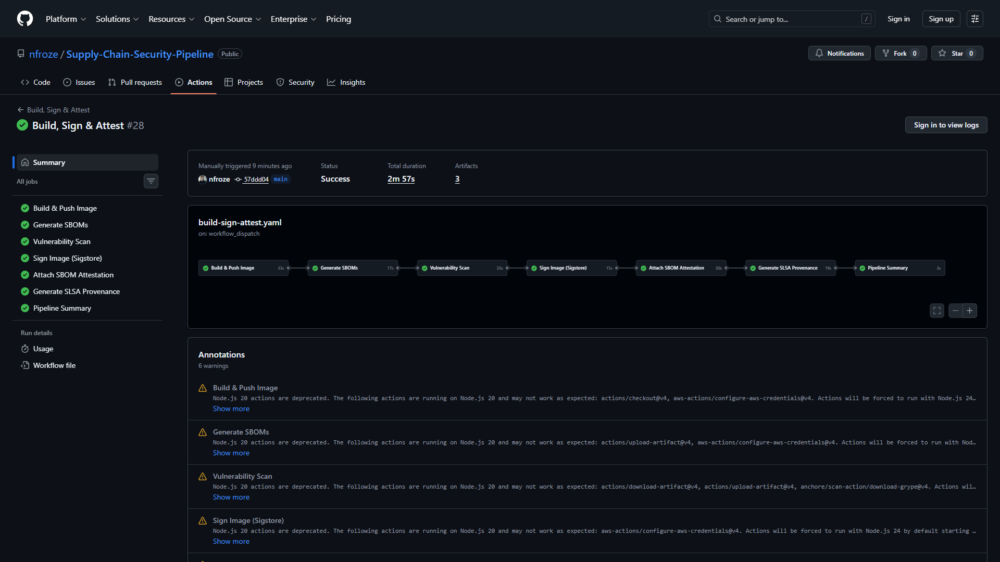

**Verify & Deploy Pipeline** — Five-stage verification workflow triggered on build completion: resolve image digest, verify cosign signature, verify SLSA provenance, verify SBOMs with deploy-time vulnerability re-scan, and deploy to EKS.

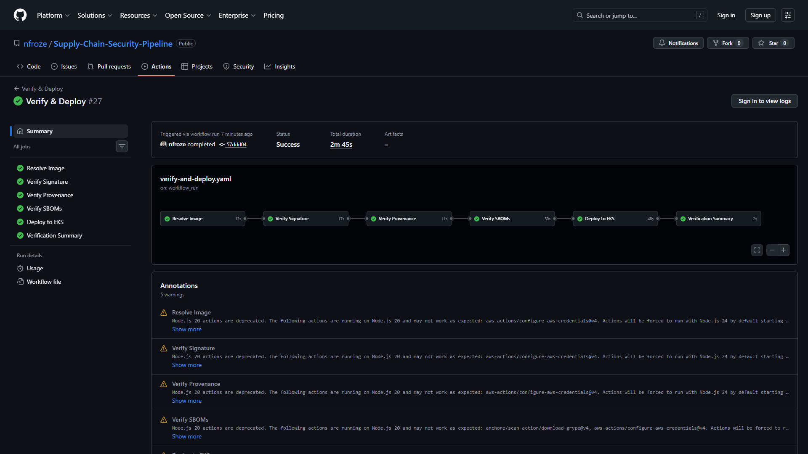

**Build Pipeline Summary** — All six stages passed with image digest and full ECR image reference confirming the signed artifact in the registry.

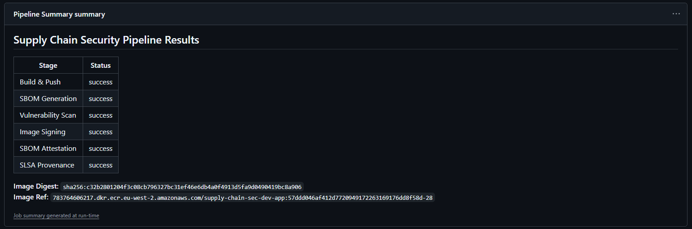

**Verification Summary** — Four-step verification chain completed: signature, provenance, SBOM verification and vulnerability scan, and deployment — with the full image digest-pinned reference.

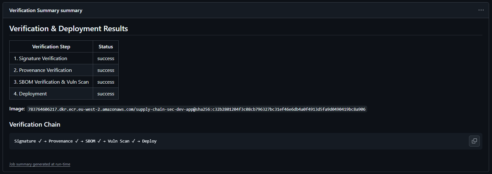

**ECR Signed Images** — Amazon ECR repository showing the application image alongside cosign signature (.sig) and attestation (.att) OCI artifacts attached to the same digest.

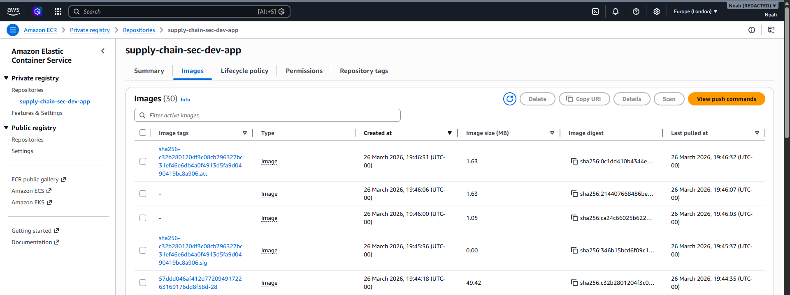

**EKS Cluster** — EKS cluster running Kubernetes v1.30 with two managed nodes (t3.medium) across eu-west-2 availability zones, both in Ready status.

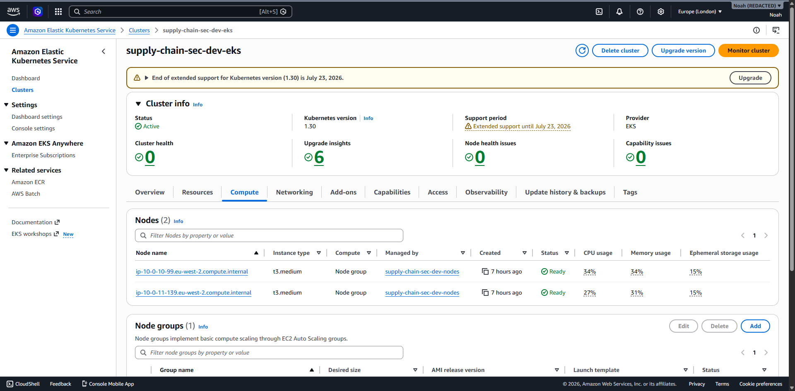

**Kyverno Policies** — Five ClusterPolicies in Enforce mode and Ready status: require-security-context, restrict-image-registries, verify-image-signature, verify-sbom-attestation, and verify-slsa-provenance.

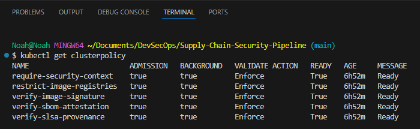

**Running Pods** — Two application replicas running in the supply-chain-demo namespace on private subnet nodes, deployed with the verified image digest.

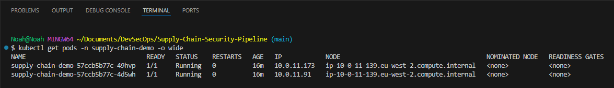

**Supply Chain Status Endpoint** — Application /supply-chain/status response showing build provenance metadata (image digest, commit SHA, build timestamp, SLSA level 2) and attestation status (signed, SBOM attached, provenance attached — all true).

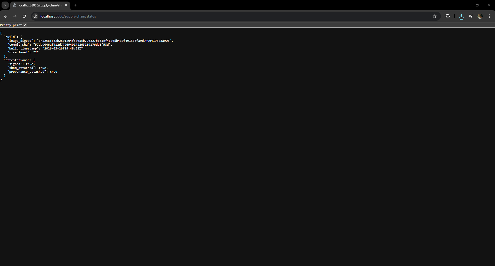

**Unsigned Image Rejected** — Kyverno admission webhook rejecting an unsigned nginx:latest image, blocking on multiple policies: require-security-context (non-root, read-only rootfs, no privilege escalation, drop all capabilities) and restrict-image-registries (not from approved ECR registry).

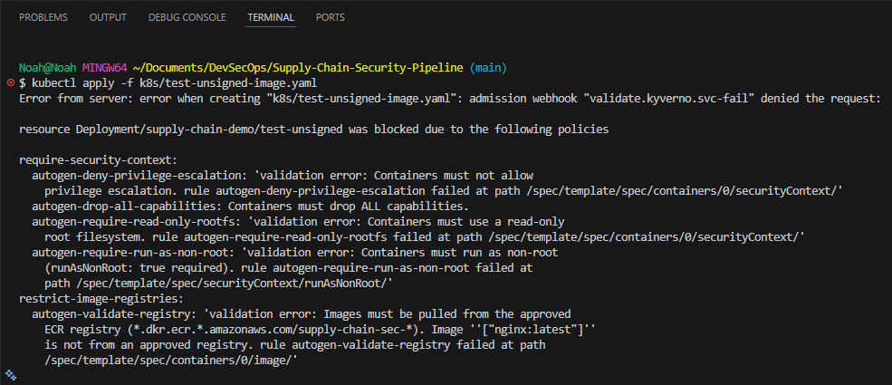

## Author

**Noah Frost**

- Website: [noahfrost.co.uk](https://noahfrost.co.uk)
- GitHub: [github.com/nfroze](https://github.com/nfroze)
- LinkedIn: [linkedin.com/in/nfroze](https://linkedin.com/in/nfroze)
